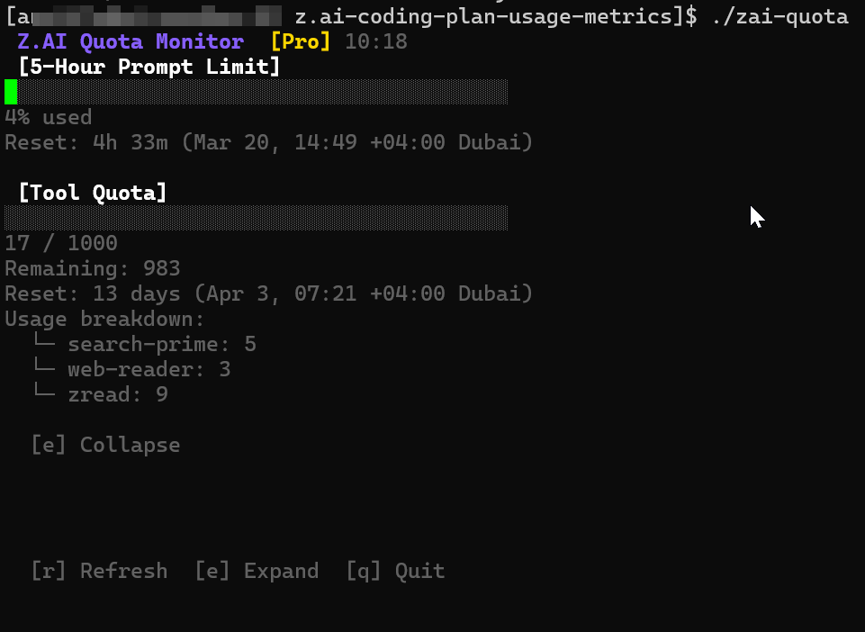

# Z.ai Quota Monitor

Monitor your Z.ai API quota usage in real time.

A terminal-based interactive dashboard for monitoring your Z.ai API quotas. Designed for hobbyists, self-hosters, or developers tracking their usage.



---

## Highlights

- **Real-time Dashboard**: Interactive TUI (Terminal UI) with colored progress bars.
- **Visual Warnings**: Bars change color (Green ➔ Amber ➔ Red) as you approach your limit.
- **Refresh**: Press `r` to refresh, or let it update automatically.
- **Dual Monitoring**: Tracks both your **Tool Quota** and **5-Hour Prompt Limit** simultaneously.
- **Expandable Details**: Press `e` to see a deep dive into usage by model.
- **Single Binary**: No runtime dependencies—download and run.
- **Automation Ready**: Output as JSON or YAML for your own scripts or Home Assistant dashboards.

---

## Quick Start

### 1. Get the binary
Download the latest version for your system from the [Releases](https://github.com/apigban/zai-quota/releases) page.

### 2. Make it executable (Linux/macOS)
```bash
chmod +x zai-quota
sudo mv zai-quota /usr/local/bin/
```

### 3. Run it!
Set your API key and run:
```bash
export ZAI_API_KEY="your-api-key-here"
zai-quota
```

---

## Setup & Configuration

### Getting your API Key
1. Log in to your [Z.ai Dashboard](https://z.ai/manage-apikey/apikey-list).
2. Navigate to **API Settings**.
3. Copy your **API Key**.

### Permanent Setup (Recommended)
You don't want to export your API key every time. You can create a simple config file in your home directory:

**Create `~/.zai-quota.yaml`:**
```yaml
api_key: your-api-key-here
# Optional settings:
# endpoint: https://api.z.ai/api/monitor/usage/quota/limit
# timeout_seconds: 5
```

Alternatively, add `export ZAI_API_KEY="your-key"` to your `.bashrc` or `.zshrc`.

---

## 🎮 Using the Dashboard

Once you launch `zai-quota`, it stays open as a live monitor:

```
┌──────────────────────────────────────────────────────────────┐
│ Z.AI Quota Monitor [Pro]                              14:32  │
├──────────────────────────────────────────────────────────────┤
│                                                              │
│  [Tool Quota]                                                │
│  ████████████░░░░░░░░ 75%                                   │
│  Reset: 2h 18m                                               │
│                                                              │
│  [5-Hour Prompt Limit]                                       │
│  ██████░░░░░░░░░░░░░░ 25%                                   │
│  Usage: 1250 / 5000                                          │
│  Remaining: 3750                                             │
│  Reset: 4h 45m                                               │
│                                                              │
│  [r] Refresh  [e] Expand Details  [q] Quit                   │
└──────────────────────────────────────────────────────────────┘
```

**Controls:**
- `r`: Refresh data immediately.
- `e`: Toggle expanded details (breakdown by model).
- `q` or `Ctrl+C`: Exit.

---

## 📊 Automation & Scripting

If you want to use this data in a custom dashboard (like Home Assistant or a status page), you can output machine-readable formats:

```bash
# Get JSON output
zai-quota --json

# Get YAML output
zai-quota --yaml
```

### Warning Levels & Exit Codes
The tool is built to be used in scripts. It returns different exit codes depending on the result:
- **0**: Success
- **1**: Configuration error (missing API key).
- **2**: Network issue (can't reach the API).
- **3**: Authentication failure (invalid API key).

---

## 📈 Prometheus Exporter

The `exporter` subcommand runs a Prometheus-compatible metrics server for monitoring your Z.ai quota usage with tools like Grafana, Alertmanager, or any Prometheus-based observability stack.

### Starting the Exporter

```bash
# Start with defaults (listens on :9090, polls every 60 seconds)
zai-quota exporter

# Custom configuration
zai-quota exporter --poll-interval=120 --listen=:8080
```

**Important**: The Z.ai API requires a minimum 60-second interval between requests. The exporter enforces this constraint and will reject lower values.

### Available Endpoints

- **`/metrics`**: Prometheus-compatible metrics endpoint
- **`/health`**: Health check endpoint (returns `OK`)
- **`/`**: Landing page with links and metric documentation

### Exposed Metrics

All metrics use the `zai_quota_` namespace:

**Prompt Usage (5-Hour Limit):**
- `zai_quota_prompt_usage_ratio`: Current usage as ratio (0-1)
- `zai_quota_prompt_reset_timestamp_seconds`: Unix timestamp when limit resets

**Tool Calls (Weekly Limit):**
- `zai_quota_tool_calls_used`: Number of tool calls used
- `zai_quota_tool_calls_limit`: Maximum allowed tool calls
- `zai_quota_tool_calls_remaining`: Remaining tool calls
- `zai_quota_tool_calls_reset_timestamp_seconds`: Unix timestamp when limit resets
- `zai_quota_tool_calls_by_tool{tool="..."}`: Per-tool usage breakdown

**Metadata & Health:**
- `zai_quota_info{level="..."}`: Subscription level (always 1)
- `zai_quota_up`: Whether last scrape succeeded (1=ok, 0=error)
- `zai_quota_last_scrape_timestamp_seconds`: Timestamp of last API poll
- `zai_quota_scrape_duration_seconds`: Duration of last API poll

### Architecture

The exporter uses a polling/caching architecture to respect the 60-second API rate limit:

```
┌──────────────┐    60s min    ┌─────────────┐    on-demand    ┌───────┐
│   Z.ai API   │◀─────────────│   Poller    │────────────────▶│ Cache │
└──────────────┘               └─────────────┘                 └───┬───┘
                                                                   │
                                   ┌───────────────────────────────┘
                                   ▼
                             ┌───────────┐
                             │  /metrics │◀── Prometheus
                             └───────────┘
```

This ensures Prometheus can scrape at any interval without violating the API rate limit.

### Prometheus Configuration

Add this to your `prometheus.yml`:

```yaml
scrape_configs:
  - job_name: 'zai-quota'
    static_configs:
      - targets: ['localhost:9090']
    scrape_interval: 30s  # Can be any interval; exporter uses cached data
```

The exporter serves cached metrics, so you can scrape frequently without hitting the Z.ai API rate limit.

### Grafana Dashboard

Example PromQL queries for Grafana:

```promql
# Prompt usage percentage
zai_quota_prompt_usage_ratio * 100

# Tool calls remaining
zai_quota_tool_calls_remaining

# Tool calls by tool (bar chart)
sum by (tool) (zai_quota_tool_calls_by_tool)

# Alert when approaching limit
zai_quota_prompt_usage_ratio > 0.8
```

---

## 🛠️ Troubleshooting

- **"API Key required"**: Make sure you've set `ZAI_API_KEY` or created the `~/.zai-quota.yaml` file.
- **"Connection Timeout"**: Check your internet. If you're on a slow connection, try increasing the timeout in your config: `timeout_seconds: 10`.
- **Colors not showing?**: Ensure your terminal supports true color (most modern ones like iTerm2, VS Code, or GNOME Terminal do).

---

### Project Structure
- `cmd/zai-quota`: Entry point and CLI flags.
- `internal/api`: Communication with Z.ai.
- `internal/tui`: The interactive dashboard logic.
- `internal/formatter`: JSON/YAML/Human output logic.

## License

This project is licensed under the GNU General Public License v2.0 - see the [LICENSE](LICENSE) file for details.

## Contributing

Found a bug or have a feature idea? Open an issue or submit a pull request!
